**PacWar(BackEnd-FrontEnd)**
======
*Proyecto desarrollado en el periodo académico 2019-1 por KAS-Entertainment para el curso Arquitecturas de Software (ARSW)*

# Profesor
  ##### Diego Alfonso Prieto Torres

# Abstract 
It is an alternative to the original game PAC-MAN where the goal is to eat all the small points and other prizes like fruits to be able to pass the level, managing to dodge the four ghosts Shadow (Blinky), Speedy (Pinky), Bashful (Inky) and Pokey (Clyde), go through the maze whose function is to try to capture Pac-Man, each ghost has a different ability to catch it.

For this alternative we will have more than one pacman, which will compete to eat the most points and kill their opponents to win. You know who won because he is the last pac-man in the game and there are no points to eat on the board.

Each player dies the moment he is hit twice by one or more ghosts or at the moment when another player attacks him with a bomb and he does not have to defend himself.

At the moment to log in the game, then they can create a game and select a map, join a game already created, see their game statistics which would be: better score as a pacman or ghost, number of ghosts or pacman eliminated, time of longest duration and number of games won respectively.

The environment in which the game is developed is a labyrinth which has points paths to be taken by the players, who must defend themselves from the ghosts or the bombs that may appear throughout the game, as aids manage a shield, a fruit and a star which helps them to stay alive and try to win the game.

Players can select the ghosts and play like them, if there are only selected pacman, they will be generated automatically. Adicionalmente, si los jugadores solo seleccionan fantasmas, los pac man se generan automáticamente.

You also have a player who is responsible for placing the powers, this type of player can work in a random way if no participant wants to play with him, otherwise a user can handle it and place the powers as he wishes.

The game will have a living room for all players to join this, depending on the number of players who join, the most appropriate map will be chosen.

When starting the game, you can access it as a spectator mode and see what happens, such as the positions of the players and their points.

The platform allows that when a player finishes the game he can observe his statistics, like the amount of points he ate, the players he "killed", the powers that he won, etc. Another of the functionalities is that in the profile of the player you can observe the games performed in a detailed way showing things like his won games, average of murders and his best records using the different characters.

During the game the players will be able to see their scores, number of murders, powers they currently have, powers of the enemies, current vitality. It will have a viewer mode in which someone outside the game can see it in real time along with all its specifications.

There are different types of levels or labyrinths depending on the number of people who wish to interact in the game. Our proposal will add more players, and modify the skills of the original characters to give the project a plus.

# Purpose

Create a game that is entertaining for all ages, easy to use and fun for different users who can interact anywhere in the world

# Problem

Have an application as competent as possible in the market, be the best in the implementation of the game Pacman as an alternative to the accustomed and attract many people of different ages.

# Demo

* This is the main page where we can see the different functionalities of the project and interact with them.

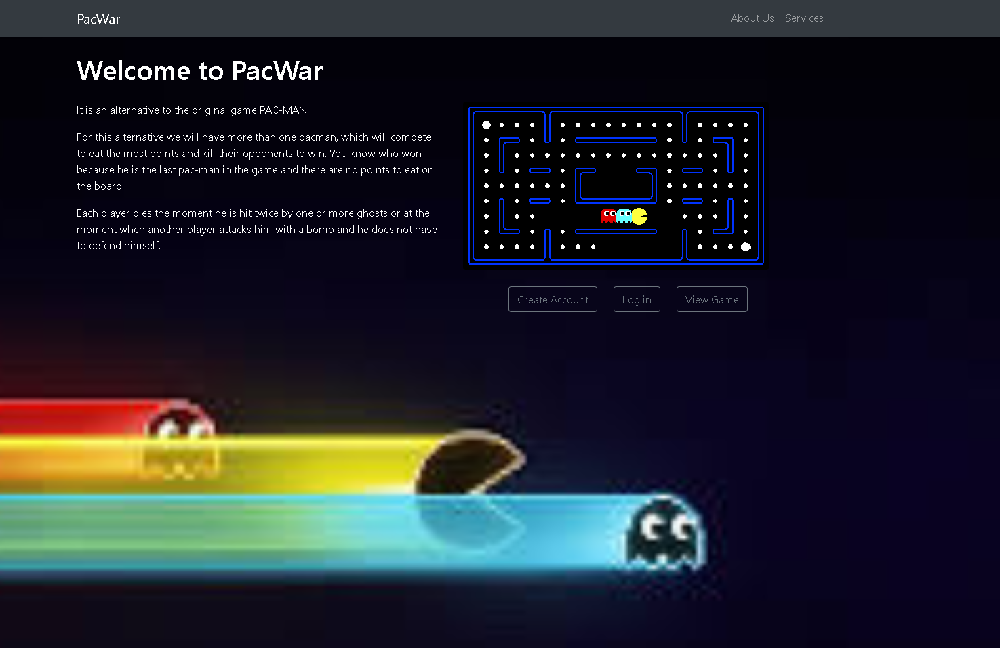

* Here we can see a brief description of the objective and of each one of the biographies of us.

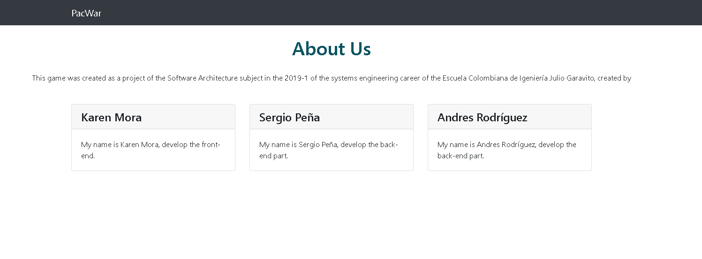

* In this page we can see the services that our application offers for the clients that use it.

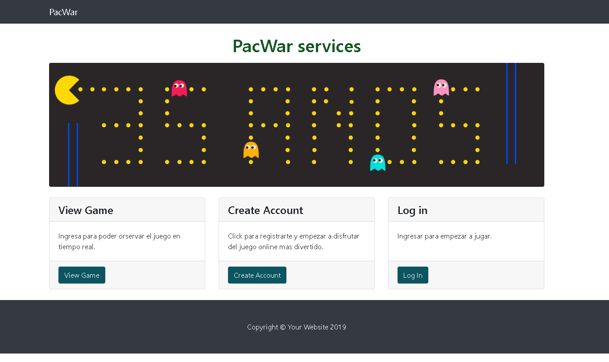

* This is where we can create an account so that it is easier to access the application and all our data is stored in it.

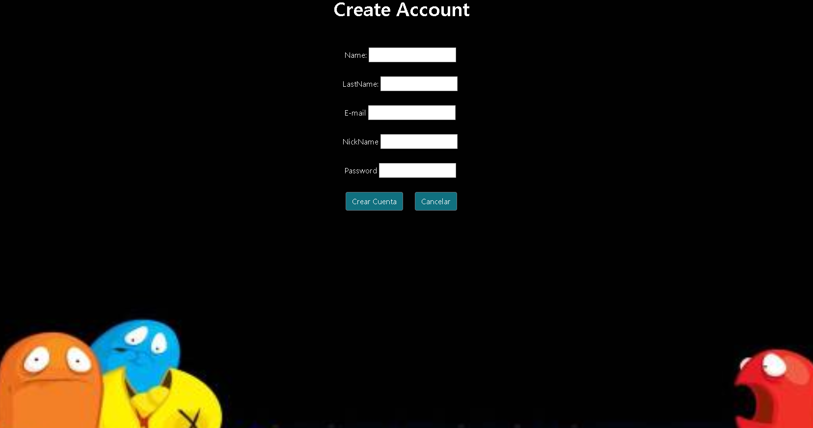

* On this page we can access our account easily.

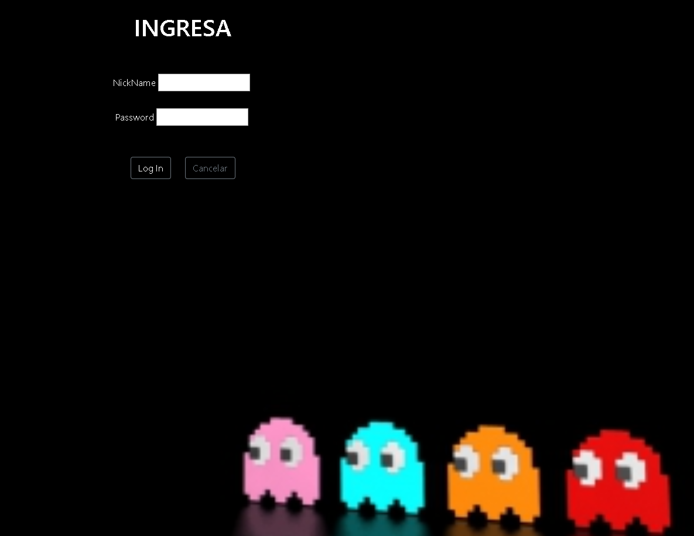

* Here we have a prototype for when it is implemented, we can see different games that are being played at the same time.

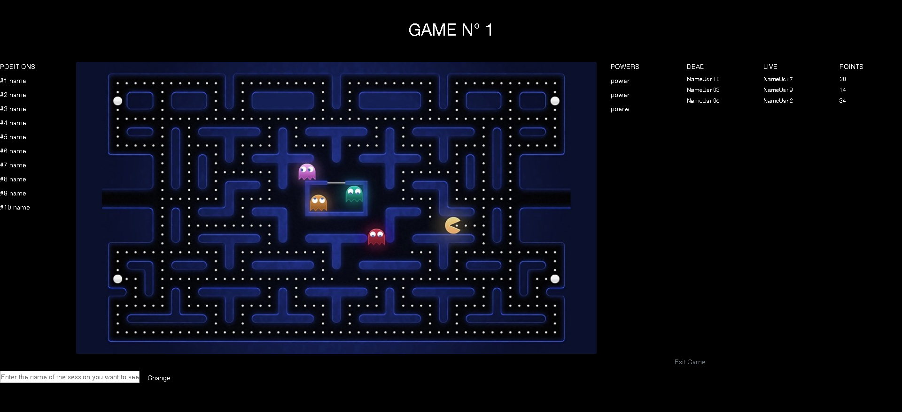

* Each player will have their own profile, in which they will have points and different attributes.

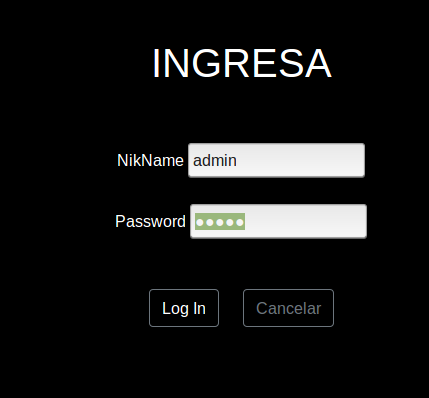

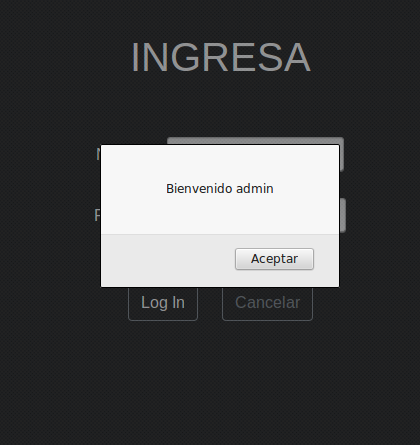

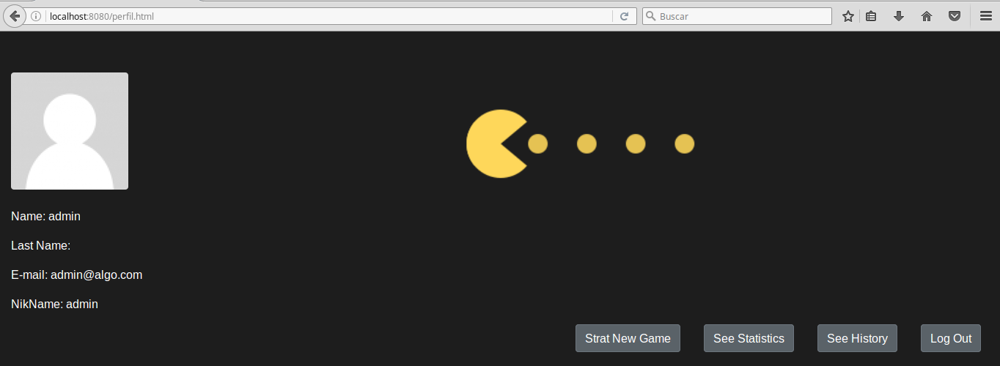

* Players can see their history and statistics to see if they have improved in the game.

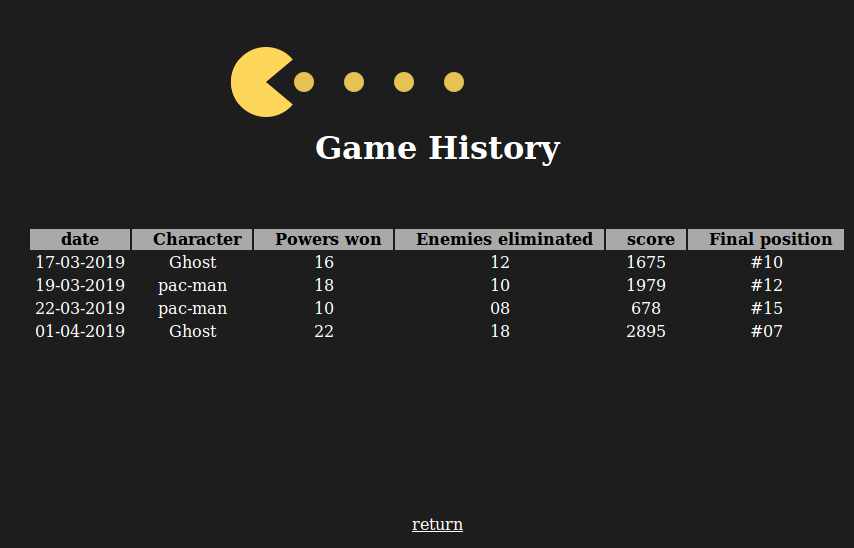

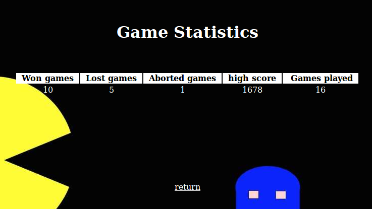

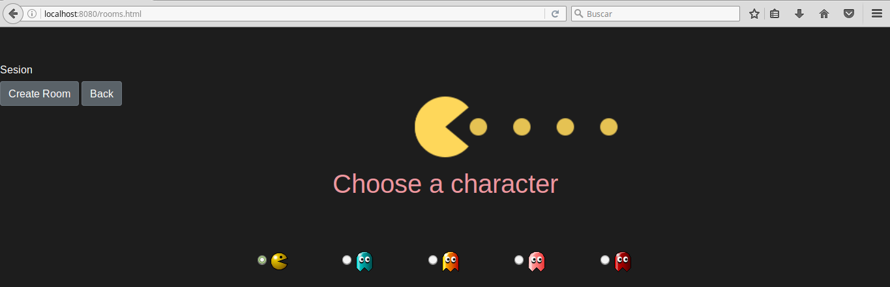

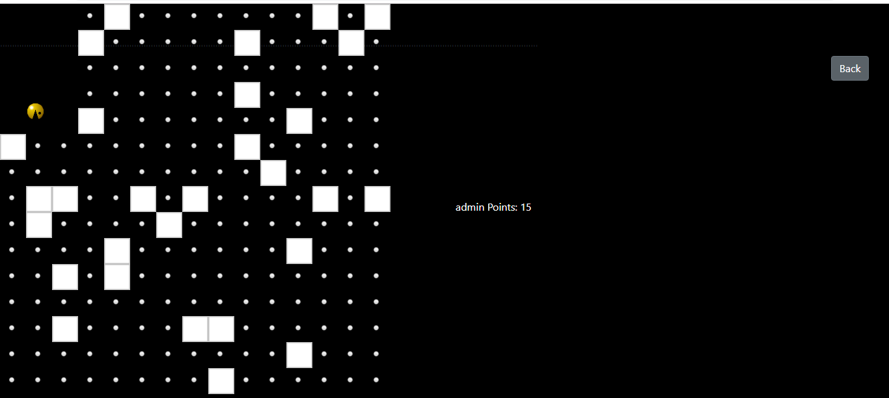

# Board elements
- Player: its function is to take all the possible points, at the same time hide from the ghosts, defend against the opponents and attack the other players to be the only player on the board and win.

- Ghost: will be responsible for touring the board to find the players and touch them to reduce energy.

- admin: Its function is to walk around the board and place the different powers.

- Bomb: appear throughout the game and can be taken by players to kill ghosts or opponents in a 5-point radius.

- Shield: appears randomly on the board to save a player from dying in case a bomb arrives.

- Fruit: appears randomly on the board and saves the player in case a ghost touches it.

- Star: appears randomly on the board and its function is to protect the player from any attack.

# Game rules
* A registration must be made in order to access the platform.

* Log in must be done to access the user's profile.

* You must add to the waiting room to later access a game.

* The player can choose whether he wants to be a ghost, an admin or a Pac-Man.

* At the moment in which the game is canceled the player "dies" and in his state it will appear that he abandoned the game.

* The function of the ghost is to touch the pac-man to take away a% of life, to win the game they must kill all the pac-man.
* The function of the admin is to place all the powers in the places you choose.

* The pac-man's function is to take the number of points and touch the other opponents until they are eliminated in order to win the game.

* At the moment when there is only one pac-man and the ghosts, a "power" will be activated.

* If nobody wants to be admin, the roll will be automatically occupied by the machine who will randomly place the powers.

* For the people who are going to keep the game, you do not need to access just need to enter the "see game" section

# Possible statistics
- General statistics

        - games won as a ghost.
        - games won as pac-man.
        - abandoned games.

- Statistics for each game

        - number of pumps obtained.
        - number of shields obtained.
        - number of fruits obtained.
        - number of stars obtained.
        - number of ghosts killed.
        - number of pac-man killed.
        - global position.
        
# Model E-R

# User stories

https://tree.taiga.io/project/karenmora-pacwar/timeline

# Instalation 

This application needs installed:

* Java
* Tomcat
* Spring
* SQL
* UML

# Class Diagram

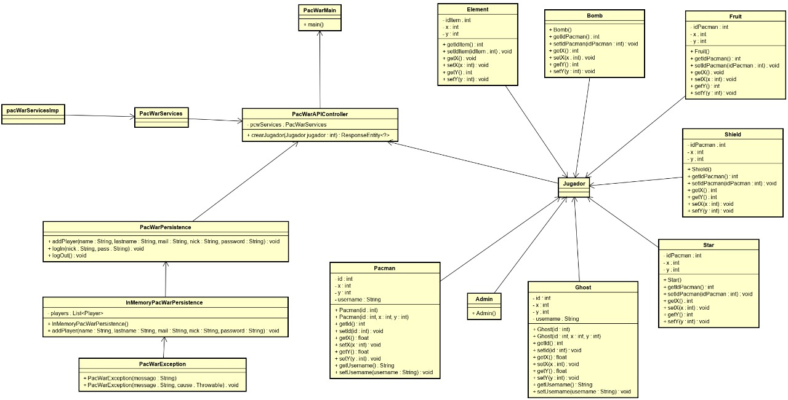

# Heroku Link

https://polar-harbor-18202.herokuapp.com/index.html

# Data Base

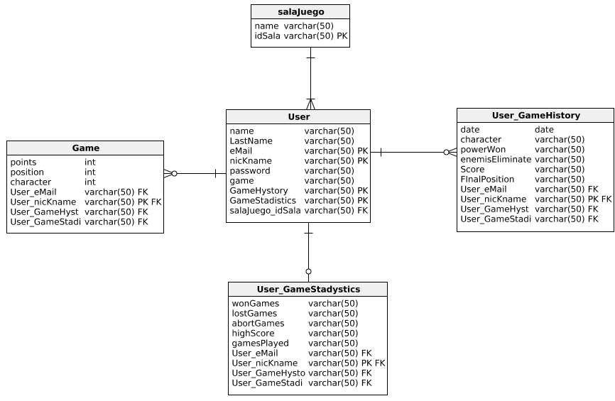

# Diagram develop

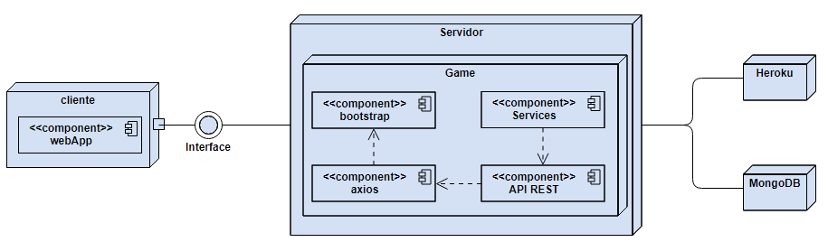

# Team names
- Karen Tatiana Mora Merchán - Developer FrontEnd
- Sergio Alejandro Peña Pinto - Developer BackEnd
